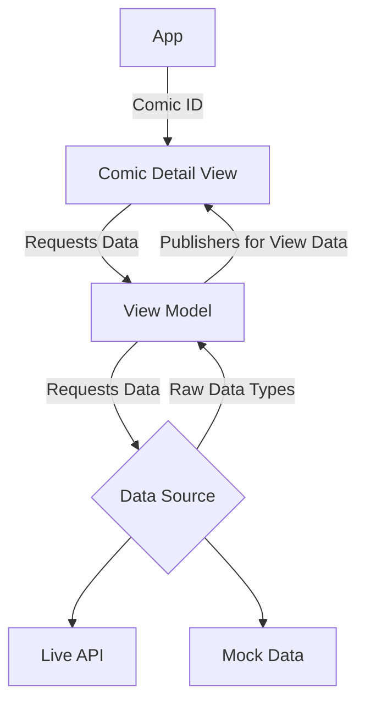

# MarvelComicDetail App

This app is built to show the detail page of a comic from Marvel's API's (developer.marvel.com).

It will load the Title, Description and Image from the API and show them on screen.

## Build Information
 - Xcode 13.2.1
 - Base SDK (iOS 15)
 - Cocoapods (1.11.2)

## Frameworks
 - Alamofire (5.5.0)
 - Combine, Swift and Swift UI

## Implementation and Running

1) Install pods
2) Update `MarvelComicApp.swift` to have the comic ID you want to load
3) Update `MarvelAPI.swift` with the private and public API key to be used
This app expects the developer to put in the comic ID when the `ComicDetailView` is initialized.  You can set this in `MarvelComicApp.swift`.

### High Level App Design

